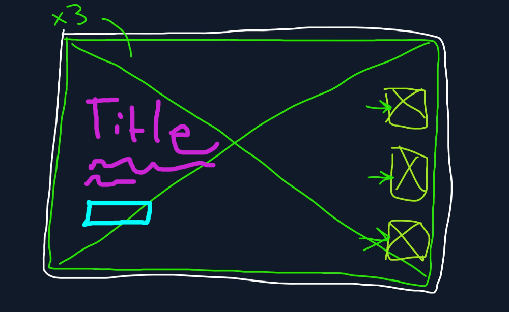

# robowave-2023
A ficticious robot company website for a Bootstrap, jQuery code-along in class.

### Technologies
* [Bootstrap 5](https://getbootstrap.com/)
* [jQuery](https://api.jquery.com/)
* [Fullpage scroll](https://alvarotrigo.com/fullPage/#)
* [Typewriter.js](https://safi.me.uk/typewriterjs/)
* [Power Glitch](https://github.com/7PH/powerglitch)
* [Oxanium Google Font](https://fonts.google.com/specimen/Oxanium)

## Wireframe

## TODOs

* [x] Large background image sections
* [ ] Image thumbnail navigation
* [ ] Headings typewriter effect
* [ ] modal with robot details

## Shout outs 📢

* [unheap.com](http://unheap.com/)
* [Awesome jQuery repo](https://github.com/petk/awesome-jquery)
* [Canva Color Palatte Generator](https://www.canva.com/colors/color-palette-generator/)
* [Coolers Color Palatte Generator](https://coolors.co)
* All images generated by `tyboMakes + Midjourney`